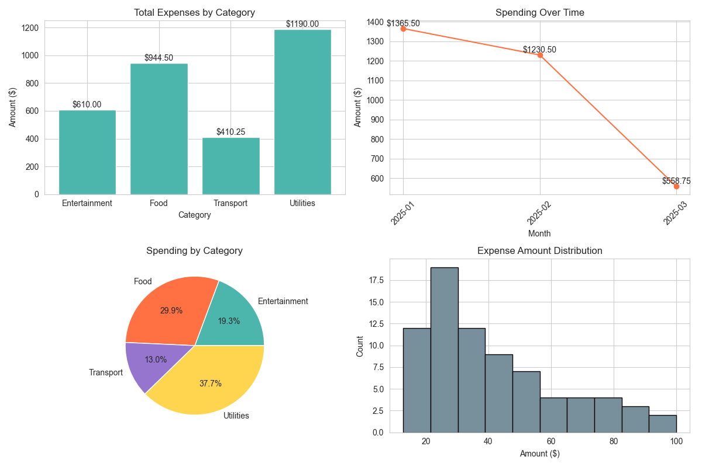

# 💰 Expense Tracker

A simple command-line based Expense Tracker built with Python, Pandas, and Matplotlib/Seaborn. It helps you log, manage, analyze, and visualize your personal expenses easily.

---

## 📦 Features

- ✅ Add and store expenses in a CSV file  
- 📊 Summarize total and average expenses  
- 🔍 Filter expenses by date, category, and amount  
- 🧾 Generate detailed reports (monthly and category-wise)  
- 📈 Visualize spending trends and patterns with graphs  
- 💾 Data persistence via `expenses.csv`

---

## 📁 File Structure

```
.
├── expense_tracker.py    # Main Python script
├── expenses.csv          # CSV file storing expenses (created automatically if not found)
├── expense_dashboard.png # Visualization output (generated after plotting)
```

---

## 🧮 Usage

Once the program starts, a menu will guide you through options:

```
1. Add New Expense
2. Show Summary
3. Filter Expenses
4. Show Report
5. Create Charts
6. Exit
```

### Sample Input (Adding Expense):

```
Date: 2025-05-18
Amount: 500
Category: Food
Description: Grocery shopping
```

---

## 📌 Categories Supported

- Food  
- Transport  
- Utilities  
- Entertainment

---

## 📊 Visualizations

Generates a file `expense_dashboard.png` with:

- Bar chart of expenses by category  
- Line chart of monthly spending  
- Pie chart of category distribution  
- Histogram of amount distribution

---

## ⚙️ Data Format

The `expenses.csv` file is structured as:

| Date       | Amount | Category    | Description       |
|------------|--------|-------------|-------------------|
| 2025-05-18 | 500    | Food        | Grocery shopping  |

---

## 🧹 Data Validation

- Amounts must be **positive**  
- Categories must be among the predefined ones  
- Invalid entries (missing/incorrect) are skipped with warnings

---

## 📸 Expense Dashboard

Below is the visualization generated by the tracker:



